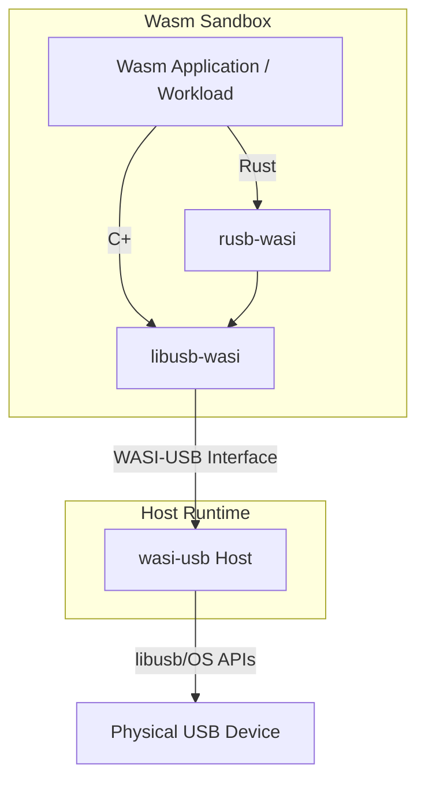

# Secure USB Access in WebAssembly: A Capability-Based Framework for Cyber-Physical IoT
### Veilige USB-toegang in WebAssembly: een capability-gebaseerd raamwerk voor cyber-fysieke IoT-toepassingen

This repository contains the source code, submodules, and documentation for a Master's Thesis focused on bringing safe, portable, and capability-based USB hardware access to WebAssembly (Wasm) via the **WASI-USB** interface.

Original research and implementation are the work of the **contributors**!

## Project Overview

The core objective of this project is to bridge the gap between high-level, sandboxed WebAssembly execution and low-level hardware interaction. By leveraging the WebAssembly Component Model and WASI Preview 2/3, we provide a unified API that works across different operating systems (Linux, macOS) and hardware architectures.

### Key Components

- **[wasi-usb](./wasi-usb/)**: The host runtime environment. It implements the WASI-USB interface and translates Wasm guest calls into native USB operations using OS-level system calls (via libusb/rusb).
- **[usb-wasm](./usb-wasm/)**: A collection of WebAssembly components and WIT definitions that utilize the WASI-USB interface. This includes a real-time YOLOv8 object detection pipeline.
- **[libusb-wasi](./libusb-wasi/)**: A modified version of the standard `libusb` C library, featuring a custom WASI backend to route I/O through the WASI-USB interface.
- **[rusb-wasi](./rusb-wasi/)**: A Rust wrapper for `libusb-wasi`, enabling Rust applications to be compiled to `wasm32-wasip2` with secure USB access.
- **[benchmarks](./benchmarks/)**: A comprehensive benchmarking suite for measuring latency and throughput overhead compared to native execution.

## Architecture

The diagram below illustrates the relationship between the Wasm guest application, the host runtime, and the physical hardware.



## Hardware & Software Support

| Platform | Architecture | Reference Hardware |
|----------|--------------|--------------------|
| macOS    | aarch64      | Apple Silicon (M-series) |
| Linux    | x86_64       | Generic Workstation |
| Linux    | aarch64      | Raspberry Pi 4/5   |

## Getting Started

### 1. Clone the repository
```bash
git clone --recursive https://github.com/idlab-discover/masters-sibren-wieme.git
cd masters-sibren-wieme
```

### 2. Build the Host Runtime
The host runtime is responsible for translating WASI-USB calls into native USB operations.
```bash
cd wasi-usb/usb-wasi-host
cargo build --release
```

## Running the Demos

### 1. Real-time YOLOv8 Object Detection
This demo showcases high-performance object detection running in a sandboxed Wasm environment with periodic frame annotation and filesystem persistence.

```bash
# Build the YOLO detector component
cd usb-wasm/command-components/yolo-detector
cargo component build --release

# Run the host with the YOLO component (Sudo required for USB access)
sudo ../../../target/release/usb-wasi-host \
    --component-path target/wasm32-wasip2/release/yolo_detector.component.wasm \
    --enable-yolo -- yolov8n.onnx
```

### 2. Webcam Streaming (WEBCAM-CV)
A real-time capture and display demonstration using the WASI-USB webcam interface.

```bash
cd usb-wasm
just webcam-cv
```

### 3. DualSense (PS5) Pacman Maze
A complete maze game featuring Ghost AI, score systems, and real-time controller input via a PS5 DualSense (or Xbox) controller.

```bash
# Ensure your PS5 controller is connected via USB
cd usb-wasm
just ps5-maze
```

## Benchmarking Suite

The project includes a comprehensive benchmarking suite to measure the latency and throughput overhead of the WASI-USB interface.

```bash
cd benchmarks
./build_all.sh
./run_benchmarks.sh
```
See the [benchmarks/README.md](./benchmarks/README.md) for detailed analysis of the performance results.

## Utility Tools

*   **lsusb**: A Wasm-based implementation of the classic utility to list USB devices.
    ```bash
    cd usb-wasm && just lsusb
    ```
*   **enumerate-devices**: A Go/Rust demonstration of device discovery via WASI-USB.
    ```bash
    cd usb-wasm && just enumerate-devices-rust
    ```

## Contributors

This research and implementation is the result of research during master thesises from:
*   **Wouter Hennen**
*   **Warre Dujardin**
*   **Robbe Leroy**
*   **Sibren Wieme**

## Licensing

This project is dual-licensed:
- **Infrastructure**: Components derived from the WASI community are subject to their original licenses (Apache 2.0 or LGPL).
- **Original Research**: All original work (CV interfaces, YOLO detector, host-side CV logic, and benchmarks) is licensed under the **MIT License**.

Copyright (c) 2026 the contributors. All rights reserved.