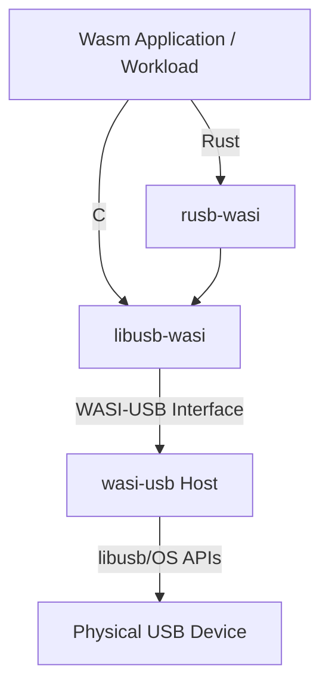

# Masterproef: Safe and Portable USB Access in WebAssembly for IoT/CPS

This repository contains the source code, submodules, and documentation for the master's thesis researching and implementing USB hardware access from within WebAssembly (Wasm) via the WASI-USB interface. 

## Structure & Submodules

The project consists of several interconnected repositories (configured as Git submodules):

- **[wasi-usb](./wasi-usb/)**: The host runtime environment. It implements the WASI-USB interface and translates Wasm guest calls into actual USB operations using OS-level system calls.
- **[libusb-wasi](./libusb-wasi/)**: A modified version of the standard `libusb` C library. It includes a custom WASI backend (`wasi_usb.c`) that routes USB operations through the WASI-USB interface instead of native OS APIs.
- **[rusb-wasi](./rusb-wasi/)**: A Rust wrapper for `libusb-wasi`. It allows Rust applications to be compiled to WebAssembly (`wasm32-wasip2`) while safely linking against the Wasm-compatible `libusb`.
- **[benchmarks](./benchmarks/)**: Latency and throughput evaluation scripts and code (both C and Rust) to measure the performance overhead of WebAssembly USB access compared to native binaries.

## YOLO CV Demo
The project includes a Computer Vision demonstration using YOLOv8 for real-time object detection.

### Build Instructions
To build the YOLO detector component:
```bash
cd usb-wasm/command-components/yolo-detector
cargo component build --release
```

### Running the Demo
Run the host with the YOLO component enabled:
```bash
sudo cargo run --release --manifest-path wasi-usb/usb-wasi-host/Cargo.toml -- \
    --component-path usb-wasm/command-components/yolo-detector/target/wasm32-wasip2/release/yolo_detector.component.wasm \
    --enable-yolo -- <path_to_yolov8n.onnx>
```

### Benchmarking
To run the YOLO performance benchmark (latency and resource tracking):
```bash
sudo ./benchmarks/run_benchmarks.sh --yolo
```

## Relationship Map



## Quick Start
To get started, clone the repository with its submodules:
```bash
git clone --recursive <repository-url>
```
For instructions on how to compile workloads and run the host, please refer to the `README.md` files in the respective subdirectories.