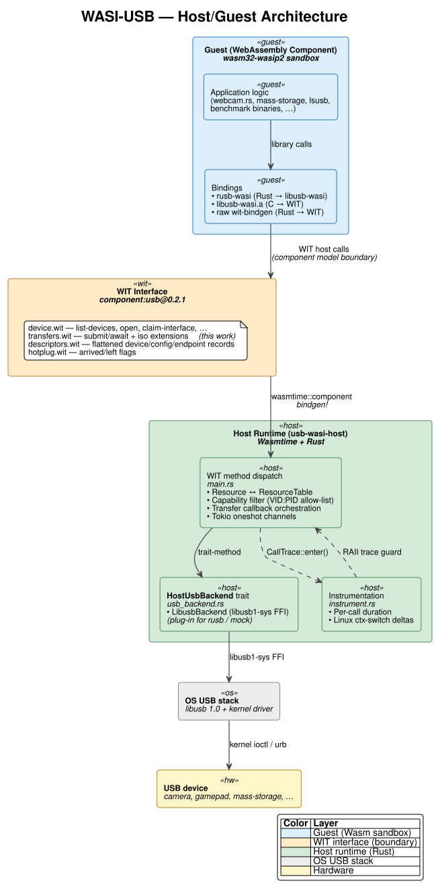
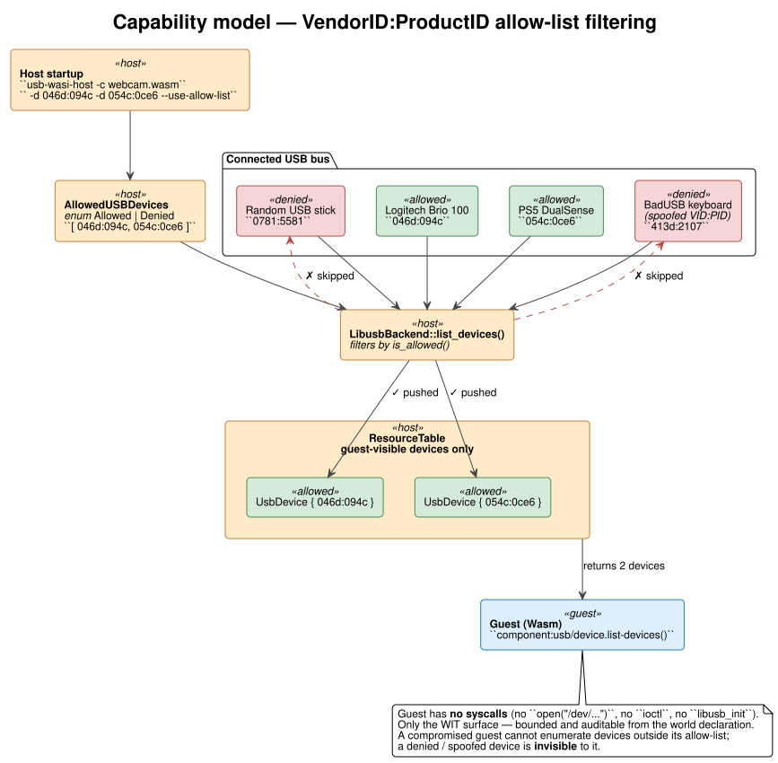
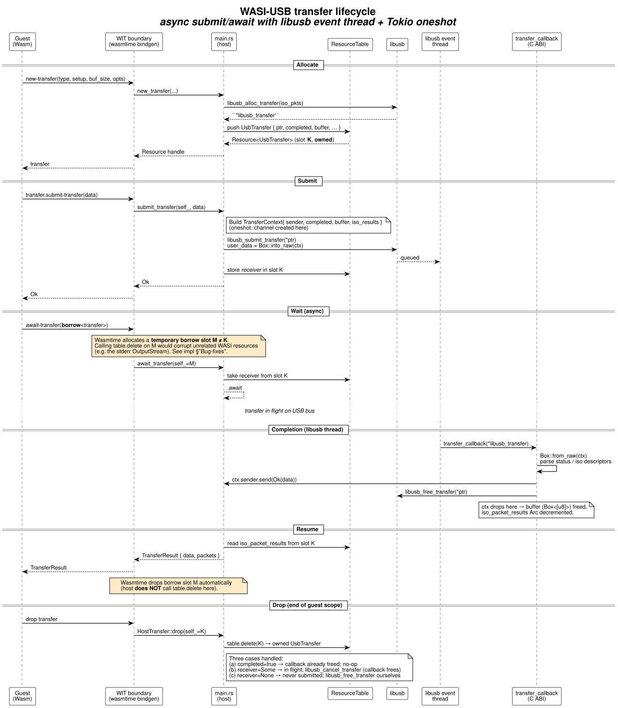

# Architecture

This document describes the architecture of the WASI-USB framework: the
host/guest split, the WIT interface design, the security model, the host runtime,
and how async transfers work across the Wasm boundary.

For the *what was built* side - the actual contributions, design decisions, and
bug fixes - see [`implementation.md`](./implementation.md).

---

## 1. High-Level Layering



The framework has five layers, each separated by a well-defined interface:

| # | Layer | Purpose | Source |
|---|-------|---------|--------|
| 1 | **Guest application** | Application logic - UVC negotiation, FAT32 parsing, HID reports, benchmark code | `usb-wasi-guest/examples/` |
| 2 | **Guest bindings** | Translates the application's library calls (rusb / libusb / raw) into WIT host calls | `rusb-wasi/`, `libusb-wasi/`, wit-bindgen |
| 3 | **WIT interface** | Stable contract: `component:usb@0.2.1` - `device`, `transfers`, `descriptors`, `hotplug`, `errors` | `wit/` |
| 4 | **Host runtime** | Wasmtime + Rust host that dispatches WIT methods, owns USB resources, enforces capabilities | `usb-wasi-host/` |
| 5 | **OS USB stack** | libusb 1.0 + kernel driver (urb / IOUSBLib) | system |

The core idea is **dumb host, smart guest**: the host only exposes generic USB
primitives (open/claim/transfer). All protocol-specific logic - UVC
Probe/Commit, MJPEG header parsing, FAT32 traversal, HID report decoding - lives
in the guest. This keeps the host small and auditable, and makes it usable for
any USB device class without changes.

---

## 2. WIT Interface Design

The interface is split into five small files under `wit/`. Splitting by
concern keeps each file focused and lets guest crates that only need a subset
(e.g. lsusb just wants `device.wit` + `descriptors.wit`) avoid pulling in the
full surface.

| File | Defines |
|------|---------|
| `device.wit` | `usb-device`, `device-handle`, `list-devices`, `open`, `claim-interface`, `new-transfer`, `set-configuration`, … |
| `transfers.wit` | `transfer` resource, `transfer-type`, `transfer-options`, `transfer-result`, `submit-transfer`, **`await-transfer`**, isochronous extensions |
| `descriptors.wit` | Flattened `device-descriptor`, `configuration-descriptor`, `interface-descriptor`, `endpoint-descriptor` |
| `hotplug.wit` | `event` flags (`arrived` / `left`), `info` record, `enable-hotplug`, `poll-events` |
| `errors.wit` | `libusb-error` enum mirroring libusb status codes |

### 2.1 Resource Model

Three resource types cross the host/guest boundary:

```wit
resource usb-device     // returned by list-devices; can be opened
resource device-handle  // returned by open(); claimable, can spawn transfers
resource transfer       // returned by new-transfer(); submit/await/cancel/drop
```

Resources are **opaque integer handles** on the guest side and live in the
host's `wasmtime::component::ResourceTable`. The guest can hold a resource,
pass it back to the host, or drop it - but it can't inspect or fabricate one.
This is the basis of the capability model: a guest can only act on devices the
host explicitly hands to it.

### 2.2 Borrow vs Owned Semantics

Probably the trickiest part of the WIT design is the owned vs. borrowed
resource distinction:

```wit
new-transfer:    func(...) -> result<transfer, libusb-error>;          // returns OWNED
submit-transfer: func(self_: borrow<transfer>, data: list<u8>);        // BORROW
await-transfer:  func(xfer: borrow<transfer>) -> result<transfer-result, libusb-error>;
cancel-transfer: func(self_: borrow<transfer>);                        // BORROW
```

When the guest passes a `borrow<transfer>`, Wasmtime allocates a **temporary
ResourceTable slot** for the duration of the host call, separate from the
slot that owns the resource. Wasmtime cleans up that borrow slot itself after
the call returns. The host **must not** call `table.delete` on it - see
[`implementation.md` §3.1](./implementation.md#31-the-borrow-bug) for the
bug this caused in practice.

### 2.3 Isochronous Transfer Extension

Isochronous transfers (camera, audio) deliver multiple variable-length
packets per submit, with per-packet status. The original WIT did not model
this. The extension contributed by this work uses a **flat-buffer + sidecar
metadata** strategy compatible with the WASI component ABI:

```wit
record transfer-result {
    data:    list<u8>,           // flat: pkt0 stride | pkt1 stride | ...
    packets: list<iso-packet>,   // empty for non-iso; one entry per iso packet
}

record iso-packet {
    actual-length: u32,
    status:        iso-packet-status,   // success | error | stall | no-device | …
}
```


The guest reconstructs per-packet views in O(N):

```rust
let mut offset = 0;
for pkt in &result.packets {
    let payload = &result.data[offset..offset + pkt.actual_length as usize];
    if pkt.status == IsoPacketStatus::Success { /* parse UVC header, append, … */ }
    offset += stride;        // stride = max packet size, NOT actual_length
}
```

**Why not `list<list<u8>>`?** Nested growable lists aren't reliably supported
in the stable component-model canonical ABI. A flat buffer means exactly one
ABI memcpy per transfer, with the `packets` sidecar carrying the slicing
metadata. See [`implementation.md` §2](./implementation.md#2-isochronous-transfer-api)
for the full rationale and the rejected alternatives.

---

## 3. Capability-Based Security Model



### 3.1 Allow-list

At startup, the host takes an explicit allow-list of `VendorID:ProductID` pairs:

```bash
sudo usb-wasi-host -c webcam.wasm \
    --use-allow-list \
    -d 046d:094c \   # Logitech Brio 100
    -d 054c:0ce6     # PS5 DualSense
```

This populates the runtime `AllowedUSBDevices` enum, which is checked on
every device enumeration. Devices outside the list are *invisible* to the
guest - they are filtered out before any handle reaches the
`ResourceTable`.

Two modes are supported:

```rust
pub enum AllowedUSBDevices {
    Allowed(Vec<USBDeviceIdentifier>),  // strict allow-list (with --use-allow-list)
    Denied(Vec<USBDeviceIdentifier>),   // deny-list (default; -d entries are blocked)
}
```

### 3.2 Comparison with Container Approaches

| Mechanism | Granularity | Bypass surface |
|-----------|-------------|----------------|
| Docker `--device=/dev/bus/usb/N/M` | Bus address, kernel-renumbered | Container can issue arbitrary transfers, enumerate via sysfs |
| Docker `--privileged` | Whole host | Full kernel access |
| WASI-USB allow-list | VID:PID per guest | Guest has no `ioctl`, no `open("/dev/...")`, no `libusb_init` - only WIT surface |

A compromised guest can't enumerate beyond its allow-list because the Wasm
sandbox has no system call that reaches the host USB stack directly.
The only attack surface is the WIT world declaration.

### 3.3 Known Limitations

- **VID:PID spoofing**: a malicious device claiming `046d:094c` will pass
  the filter. Hardware-level attestation (USB Authentication Spec, TPM-backed
  identity) is complementary but out of scope.
- **Per-endpoint policy** is not yet enforced - once the device is opened,
  the guest can claim any interface and submit any transfer. A finer
  capability model (per-endpoint, per-class) is a natural extension.

---

## 4. Host Runtime

The host is a single Rust binary built from four source files:

| File | Lines | Role |
|------|------:|------|
| `main.rs` | 982 | WIT method implementations, CLI, transfer callback, Wasmtime setup |
| `usb_backend.rs` | 545 | `HostUsbBackend` trait + `LibusbBackend` implementation |
| `instrument.rs` | 182 | Per-call duration + Linux ctx-switch tracing |
| `host.rs` | 309 | Generated WIT bindings (do not edit) |

### 4.1 `MyState` - the Wasmtime store data

```rust
struct MyState {
    table: ResourceTable,                    // owns all USB resources
    ctx: WasiCtx,                            // standard WASI capabilities (stdio, fs)
    allowed_usbdevices: AllowedUSBDevices,   // capability filter
    backend: Box<dyn HostUsbBackend>,        // pluggable USB backend
}
```

Every WIT method receives `&mut MyState`. The `table` is the single source
of truth for resource lifetimes; the `backend` is the only path to the OS
USB stack.

### 4.2 Backend Abstraction - `HostUsbBackend` trait

The trait separates *what* USB operations exist from *how* they are
implemented. In earlier versions, libusb calls were scattered throughout
`main.rs`; now every OS-level call goes through one of these methods:

```rust
pub trait HostUsbBackend: Send + Sync {
    fn init(&mut self) -> Result<(), LibusbError>;
    fn list_devices(&mut self, allowed: &AllowedUSBDevices)
        -> Result<Vec<(UsbDevice, DeviceDescriptor, DeviceLocation)>, LibusbError>;
    fn open(&mut self, device: &UsbDevice) -> Result<UsbDeviceHandle, LibusbError>;
    fn close(&mut self, handle: UsbDeviceHandle);
    fn claim_interface(&mut self, handle: &UsbDeviceHandle, ifac: u8)
        -> Result<(), LibusbError>;
    /* … set_configuration, kernel_driver_active, descriptors, hotplug … */
}
```

The default implementation is `LibusbBackend` (libusb1-sys FFI). A `RusbBackend`
is a single-file drop-in; a `MockBackend` for tests would look similar.
**The guest doesn't know which backend is running** - the WIT contract is
the same in all cases.

This matters for the thesis because it lets us answer "libusb vs rusb - which is
faster?" by swapping backends under identical guest code, keeping language choice
separate from WASI overhead.

### 4.3 Resource Tables and Lifecycle

Three resource types live in `MyState::table`:

```rust
UsbDevice         // raw *libusb_device + ref-counted via libusb_ref_device
UsbDeviceHandle   // *libusb_device_handle from libusb_open
UsbTransfer       // *libusb_transfer + buffer + tokio receiver + iso results
```

Each has a corresponding `Drop` impl that handles the unsafe cleanup
(`libusb_unref_device`, `libusb_close`, `libusb_free_transfer`). The Drop
impls are *the only place* OS-level resources are released - every other
method either pushes a resource into the table or borrows it for an
operation.

The `UsbTransfer::Drop` is the most subtle, because three distinct states
must be handled correctly. See [`implementation.md` §3.2](./implementation.md#32-the-three-state-drop)
for the full state machine.

---

## 5. Async Transfers - The Tokio Oneshot Pattern

USB transfers are inherently asynchronous: `libusb_submit_transfer` queues
the transfer and returns immediately; the actual completion is signalled
later via a C callback fired from libusb's event thread. We bridge this to
Wasmtime's async runtime using a Tokio oneshot channel per transfer.



### 5.1 Three Concurrent Domains

| Thread | Owned by | Role |
|--------|----------|------|
| **Tokio main thread** | `#[tokio::main]` | Runs Wasmtime, executes WIT methods |
| **libusb event thread** | `LibusbBackend::init()` | Loops on `libusb_handle_events_timeout_completed()` (20 ms) |
| **C callback (`transfer_callback`)** | libusb event thread | Reads completion data, sends through oneshot |

The libusb event thread is a long-lived `std::thread::spawn` started once at
host init; it has no async runtime. The C callback runs on this thread,
constructs a `Result<Vec<u8>, LibusbError>` from the libusb status, and
fires it through a Tokio oneshot sender. The Tokio main thread (which is
`.await`ing the receiver inside `await_transfer`) wakes up and completes the
WIT method.

### 5.2 Why Oneshot, not mpsc

A oneshot channel fits well here: every transfer has exactly **one** producer
(the callback) and **one** consumer (`await-transfer`). There's no fan-in or
fan-out. Using a Tokio oneshot rather than a `parking_lot::Condvar` means we
integrate cleanly with Wasmtime's async component support without blocking the
Tokio thread.

### 5.3 Memory Ownership

The C callback receives a `*mut TransferContext` via the libusb
`user_data` pointer. The `TransferContext` is constructed in
`submit_transfer` with `Box::into_raw` (transferring ownership to libusb)
and reclaimed in the callback with `Box::from_raw` (transferring it back to
Rust). The `Box` is then dropped at the end of the callback, freeing:

- the buffer (`Box<[u8]>`)
- the oneshot sender (sends, then drops)
- the `Arc<AtomicBool>` (refcount decrement; the `UsbTransfer` keeps a clone)
- the `Arc<Mutex<Option<Vec<(u32, i32)>>>>` for ISO packet results

Once the callback finishes, `libusb_free_transfer(transfer)` releases the
underlying libusb structure. The `UsbTransfer` resource still in the
ResourceTable is now an empty shell; its `completed` flag tells subsequent
operations that the transfer is done.

---

## 6. Hotplug

`enable-hotplug` registers a libusb callback that pushes events onto a
global `Mutex<VecDeque<(Event, Info, UsbDevice)>>`. The guest polls with
`poll-events`, which drains the queue. Why a queue rather than a stream:

- The `wit` definition uses `flags event { arrived; left; }` - an event is a
  bit-flag value, not an opaque resource. A list of events fits the
  flag-based model naturally.
- WIT `result<_, libusb-error>` (no pollable) was chosen for `enable-hotplug`
  because the underlying libusb hotplug API is push-based; modelling it as
  a pollable stream would require a host-side bridging future per
  registration, which adds complexity for no measurable benefit at the
  guest API level.

The allow-list is consulted **inside the C callback** (`hotplug_cb`) so
that disallowed devices never even enter the queue.

---

## 7. Instrumentation

`instrument.rs` provides a RAII `CallTrace` guard that, on drop, logs:

- `dur_us` - wall-clock duration of the host method
- `ctx_vol_delta` / `ctx_nvol_delta` - voluntary / non-voluntary context
  switch deltas, read from `/proc/self/status` on Linux
- a free-form detail string supplied by the caller

Activated via `RUST_LOG=wasi_usb_trace=info`. Used in the thesis evaluation
to attribute overhead to specific WIT calls. See [`implementation.md` §5](./implementation.md#5-instrumentation-instrumentrs)
for the rationale and the performance gating that keeps the trace cheap when
disabled.

---

## 8. Threading Model - Summary

| Concern | Strategy |
|---------|----------|
| Host concurrency model | Tokio multi-threaded runtime via `#[tokio::main]` |
| WIT method execution | `&mut MyState` - serial within a guest instance |
| USB completion delivery | Dedicated libusb event thread; oneshot channel into Tokio |
| Hotplug delivery | libusb callback → global `Mutex<VecDeque>` → guest polls |
| Per-transfer state | `Arc<AtomicBool>` shared between C-callback and Rust drop path |

There is no thread pool of guest instances; each `usb-wasi-host` invocation
runs **one** guest. Multi-tenant setups run multiple host processes, each with
its own allow-list. Running multiple guests in a single process would complicate
the capability model (per-instance allow-lists, per-instance backend state)
without gaining anything over just using separate OS processes.

---

## See also

- [`implementation.md`](./implementation.md) - concrete contributions, design decisions, bug fixes
- [`compiling.md`](./compiling.md) - how to build host + guests + benchmarks
- [`benchmarking.md`](./benchmarking.md) - C1-C5 evaluation matrix
- [`thesis.md`](./thesis.md) - chapter mapping and research framing
