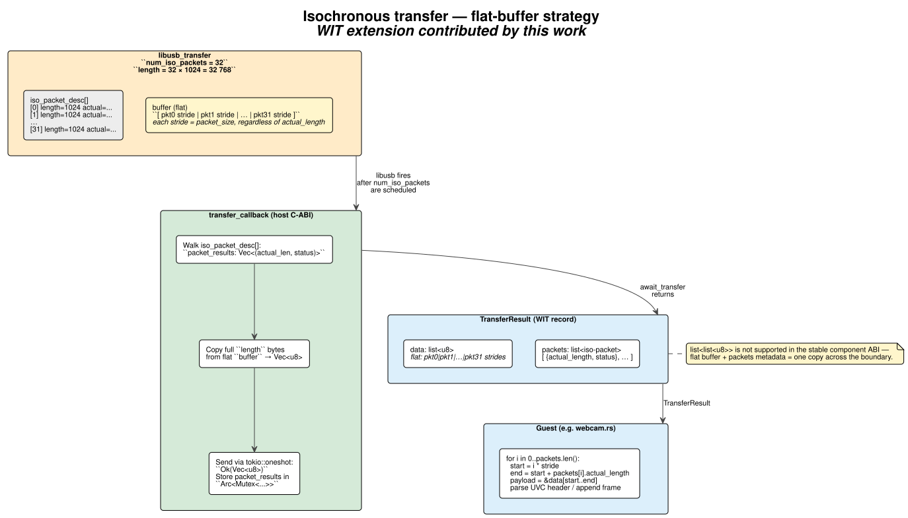
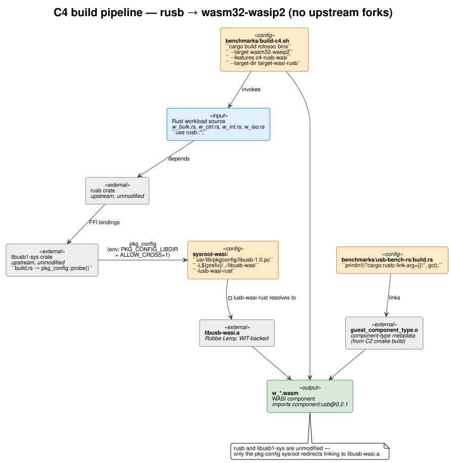

# Implementation — what was built and why

This document covers the concrete contributions. For each one it explains what the problem was, why this particular approach was chosen, and where to find the code.

It goes together with [architecture.md](./architecture.md), which describes the finished system. This document explains the choices and the things that didn't work on the first try.

The starting point is the prior work of Wouter Hennen (initial WIT-based host, single-backend, synchronous-only) and Robbe Leroy (`libusb-wasi.a` with the `wasi_usb.c` backend and cguest bindings). Everything below is built on top of that baseline.

---

## Contributions at a glance

| # | Contribution | Files |
|---|--------------|-------|
| 1 | Backend abstraction (`HostUsbBackend` trait) | `usb-wasi-host/src/usb_backend.rs` |
| 2 | Isochronous transfer API + flat-buffer strategy | `wit/transfers.wit`, `usb-wasi-host/src/main.rs` |
| 3 | Resource-lifecycle correctness (3 critical bug fixes) | `usb-wasi-host/src/main.rs`, `libusb-wasi/libusb/os/wasi_usb.c` |
| 4 | Tokio oneshot async-transfer pattern | `usb-wasi-host/src/main.rs` |
| 5 | Host instrumentation (`instrument.rs`) | `usb-wasi-host/src/instrument.rs` |
| 6 | C4 cross-compile pipeline (rusb to WASM, no fork) | `sysroot-wasi/`, `benchmarks/build-c4.sh` |
| 7 | UVC webcam guest (smart-guest CPS workload) | `usb-wasi-guest/examples/webcam/` |
| 8 | Five-condition benchmark suite (C1-C5) | `benchmarks/usb-bench-c/`, `benchmarks/usb-bench-rs/` |

---

## 1. Backend Abstraction — `HostUsbBackend` Trait

### The problem

In the inherited host, libusb FFI calls were inlined throughout `main.rs`. This made it impossible to swap backends for the libusb-vs-rusb thesis question, impossible to mock USB without real hardware, and left no clean place for cross-cutting concerns like capability filtering and descriptor flattening.

### The approach

A trait `HostUsbBackend` (in `usb-wasi-host/src/usb_backend.rs`) defines every OS-level USB operation the host needs. `LibusbBackend` implements it via `libusb1-sys`. The host stores `Box<dyn HostUsbBackend>` in `MyState` and never references `libusb1_sys` outside the trait impl.

```rust
pub trait HostUsbBackend: Send + Sync {
    fn init(&mut self) -> Result<(), LibusbError>;
    fn list_devices(&mut self, allowed: &AllowedUSBDevices)
        -> Result<Vec<(UsbDevice, DeviceDescriptor, DeviceLocation)>, LibusbError>;
    fn open(&mut self, device: &UsbDevice) -> Result<UsbDeviceHandle, LibusbError>;
    fn claim_interface(&mut self, handle: &UsbDeviceHandle, ifac: u8) -> Result<(), LibusbError>;
    fn enable_hotplug(&mut self, allowed: AllowedUSBDevices) -> Result<(), LibusbError>;
    fn poll_events(&mut self) -> Vec<(Event, Info, UsbDevice)>;
    /* … set_configuration, get_*_descriptor, kernel_driver_*, etc. … */
}
```

Why dynamic dispatch (`Box<dyn …>`) rather than generics? A generic `MyState<B: HostUsbBackend>` would propagate the type parameter through every WIT impl and duplicate the binary if multiple backends were ever in one build. The vtable indirection is negligible compared to the USB syscall latency that follows.

The allow-list is filtered inside `list_devices` rather than higher up, so a disallowed device is never assigned a `Resource` and never reaches `MyState::table`. If the filter were applied after the backend returned, a future bug could accidentally expose disallowed devices.

---

## 2. Isochronous Transfer API

### The problem

The inherited WIT supported control, bulk, and interrupt transfers, but not isochronous. Adding it required answering three questions: how does the guest specify "N packets of size S each"; how are per-packet statuses reported; and how are variable-actual-length packets returned across the WASI ABI, which is more restricted than native libusb?

### The approach — flat-buffer + sidecar metadata

```wit
enum iso-packet-status {
    success, error, timed-out, cancelled, stall, no-device, overflow,
}

record iso-packet {
    actual-length: u32,
    status:        iso-packet-status,
}

record transfer-result {
    data:    list<u8>,           // flat: pkt0 stride | pkt1 stride | …
    packets: list<iso-packet>,   // empty for non-iso; one entry per ISO packet
}
```

The host allocates `libusb_alloc_transfer(iso_packets)` with equal per-packet reservations. When the C callback fires, it reads each `(actual_length, status)` into a `Vec<(u32, i32)>` stored in an `Arc<Mutex<Option<…>>>` shared with the `UsbTransfer`. `await_transfer` reads and reshapes that into `Vec<IsoPacket>` for the WIT return.



The guest reconstructs per-packet views in O(N):

```rust
let mut offset = 0;
for pkt in &result.packets {
    let payload = &result.data[offset..offset + pkt.actual_length as usize];
    if pkt.status == IsoPacketStatus::Success { /* parse UVC header, append frame … */ }
    offset += stride;    // stride = max packet size, NOT actual_length
}
```

### Rejected alternatives

**`list<list<u8>>`**: The WASI component-model canonical ABI doesn't stably support nested growable lists across the host/guest boundary. A flat `list<u8>` is one ABI memcpy with decades of compiler support behind it.

**Separate `await-iso-transfer`**: This would duplicate the entire async/oneshot machinery and force the guest to choose which call to make based on the transfer type it already knows. A single `await-transfer` returning `TransferResult { data, packets }` with `packets` empty for non-iso is cleaner. The guest checks `if !result.packets.is_empty()`.

**Pollable stream of frames**: UVC frame reassembly (FID-bit tracking, header parsing, JPEG validation) is guest logic. The host should not know what UVC is. A per-frame stream interface would push UVC semantics into the host, violating the dumb-host principle.

### Why `iso_packet_results` is `Arc<Mutex<Option<…>>>`

The C callback runs on the libusb event thread; `await_transfer` runs on the Tokio main thread. The `Option` is `None` until the callback fires, then `Some(vec)`. `await_transfer` calls `.take()`, leaving `None` — so the cell resets for any re-submit on the same `UsbTransfer`.

---

## 3. Resource-Lifecycle Bug Fixes

Three bugs in the inherited code showed up when running real workloads. They're documented here because they reveal non-obvious properties of the WASI component model and libusb that are easy to get wrong again.

### 3.1 The borrow bug

**Symptom**: the webcam crashed on frame #2 with "resource is of another type". Frame #1 worked. The error came from the next `eprintln!` in the guest, which suddenly couldn't find its stderr OutputStream.

**Root cause**: `await-transfer` is declared `borrow<transfer>` in the WIT. Wasmtime allocates a temporary slot M in the ResourceTable, distinct from the owned slot K from `new-transfer`. After the call returns, Wasmtime frees slot M itself.

The buggy implementation called `self.table.delete(self_)` inside `await_transfer`, freeing slot M from underneath Wasmtime. After enough ISO transfers, the freed slot index coincided with the OutputStream's slot. The next `eprintln!` found a `UsbTransfer` there instead — hence "resource is of another type."

**Fix**: remove the `table.delete` call entirely. The owned slot K is cleaned up by `HostTransfer::drop` when the guest drops the resource.

```rust
async fn await_transfer(&mut self, self_: Resource<UsbTransfer>) -> Result<...> {
    /* … receiver.await, build TransferResult … */

    // Do NOT call self.table.delete(self_) here.
    // await-transfer in the WIT is declared as borrow<transfer>, so Wasmtime
    // passes a temporary slot M, not the owned slot K from new_transfer.
    // Deleting M corrupts unrelated WASI resources (e.g. the stderr OutputStream).

    Ok(TransferResult { data, packets })
}
```

The failure mode is particularly nasty because the symptom (wrong resource type on stderr) looks completely unrelated to the actual cause (double-free of a ResourceTable slot). Once you understand the borrow vs. owned distinction, the fix is one line.

### 3.2 The three-state Drop

**Problem**: the original `UsbTransfer::drop` called `libusb_cancel_transfer` without ever calling `libusb_free_transfer` or `table.delete`. This caused both a memory leak (transfers accumulate) and a use-after-free (cancel on a transfer the callback already freed).

**Fix**: a proper state machine with three paths:

```rust
fn drop(&mut self, self_: Resource<UsbTransfer>) -> Result<(), Error> {
    if let Ok(transfer) = self.table.delete(self_) {
        unsafe {
            if transfer.completed.load(Ordering::SeqCst) {
                // Callback already fired and called libusb_free_transfer. Nothing to do.
            } else if transfer.receiver.is_some() {
                // Still in flight. Cancel; callback fires with status=CANCELLED
                // and calls libusb_free_transfer.
                let _ = libusb_cancel_transfer(transfer.transfer);
            } else {
                // Allocated but never submitted. No callback will ever fire.
                libusb_free_transfer(transfer.transfer);
            }
        }
    }
    Ok(())
}
```

| State | `completed` | `receiver` | Action |
|-------|-------------|------------|--------|
| Awaited | `true` | `None` | nothing (callback already freed) |
| In flight | `false` | `Some` | cancel (callback will free) |
| Allocated only | `false` | `None` | free directly |

Async resource cleanup is not symmetric with allocation. A transfer may have already completed, may be in flight, or may never have been submitted — and the Drop path has to handle all three without races.

### 3.3 LIBUSB_ERROR_BUSY on tight ISO loops

**Symptom**: C2/C4 isochronous benchmark fails on iteration #2 with `LIBUSB_ERROR_BUSY`. A single re-used `libusb_transfer` can't be re-submitted.

**Root cause**: the inherited `wasi_usb.c` called `usbi_handle_transfer_completion()` synchronously from inside `wasm_submit_transfer` — before libusb's core had a chance to set `IN_FLIGHT`. The sequence in `libusb/io.c` is:

```
libusb_submit_transfer():
    1. clear IN_FLIGHT
    2. backend->submit_transfer()   <- completion fires here in the WASI backend
    3. set IN_FLIGHT                <- too late, transfer is already done
```

After step 3, `IN_FLIGHT` is set on an already-completed transfer. The event loop never clears it because there are no real file descriptors to poll. Next iteration sees `IN_FLIGHT` and returns `BUSY`.

**Fix**: defer completion to `wasm_handle_events`, which is called from the event loop after `IN_FLIGHT` is set:

```c
// submit_transfer: just mark as done, don't signal yet
tpriv->completed = 1;
tpriv->transfer_status = LIBUSB_TRANSFER_COMPLETED;
wasi_pending_completions++;
return LIBUSB_SUCCESS;

// wasm_handle_events: called from the event loop *after* IN_FLIGHT is set
list_for_each_entry(itransfer, &ctx->flying_transfers, list, ...) {
    if (tpriv->completed) {
        usbi_handle_transfer_completion(itransfer, tpriv->transfer_status);
    }
}
```

A synchronous backend in an async-by-design host is a mismatch. The fix is the standard "defer to the event loop" pattern, but spotting the bug requires knowing that `IN_FLIGHT` is set *after* the backend returns — documented in libusb but easy to miss.

---

## 4. Async Transfer — Tokio Oneshot Pattern

USB transfers are inherently async: `libusb_submit_transfer` returns immediately and the completion is signalled later via a C callback on libusb's event thread. The bridge to Wasmtime's async runtime uses a Tokio oneshot channel per transfer.

```rust
struct TransferContext {
    sender:             oneshot::Sender<Result<Vec<u8>, LibusbError>>,
    completed:          Arc<AtomicBool>,
    buffer:             Box<[u8]>,
    iso_packet_results: Arc<Mutex<Option<Vec<(u32, i32)>>>>,
}

// In submit_transfer:
let (sender, receiver) = oneshot::channel();
let ctx = Box::new(TransferContext { sender, ... });
(*transfer_ptr).user_data = Box::into_raw(ctx) as *mut _;
(*transfer_ptr).callback  = transfer_callback;
libusb_submit_transfer(transfer_ptr);
usb_transfer.receiver = Some(receiver);

// The C callback (libusb event thread):
extern "system" fn transfer_callback(transfer: *mut libusb_transfer) {
    unsafe {
        let ctx = Box::from_raw((*transfer).user_data as *mut TransferContext);
        let result = parse_completion_status(transfer);
        ctx.completed.store(true, Ordering::SeqCst);
        let _ = ctx.sender.send(result);
        libusb_free_transfer(transfer);
        // ctx drops here — buffer freed, sender consumed
    }
}

// In await_transfer (Tokio thread):
async fn await_transfer(&mut self, self_: Resource<UsbTransfer>) -> ... {
    let receiver = self.table.get_mut(&self_).unwrap().receiver.take().unwrap();
    let data = receiver.await?;    // Tokio yields here; libusb thread wakes us
    /* … */
}
```

Oneshot fits because every transfer has exactly one producer (the callback) and one consumer (`await-transfer`). `Receiver::await` cooperates with Wasmtime's async component support without blocking the executor — a `Condvar` would block a Tokio worker thread.

The `Arc<AtomicBool>` for `completed` gives both the C callback (writer) and the Drop path (reader) a stable reference without a mutex. The flag transitions at most once per transfer lifetime, so an atomic load in the Drop path is sufficient.

---

## 5. Instrumentation — `instrument.rs`

The thesis evaluation needs per-call latency attribution: how much of the total transfer time is host-side overhead vs. USB bus time vs. Wasmtime boundary crossing. Without per-call data, the WASI overhead claim is unfalsifiable.

### Approach — RAII trace guard

```rust
pub struct CallTrace {
    op:      &'static str,
    started: Instant,
    detail:  String,
    #[cfg(target_os = "linux")] ctx_start: Option<CtxSwitches>,
}

impl Drop for CallTrace {
    fn drop(&mut self) {
        if !log::log_enabled!(target: "wasi_usb_trace", log::Level::Info) { return; }
        let dur_us = self.started.elapsed().as_micros();
        log::info!(target: "wasi_usb_trace", "op={} dur_us={} {} {}",
            self.op, dur_us, ctx_deltas, self.detail);
    }
}
```

Used at the top of every WIT method that matters:

```rust
fn submit_transfer(&mut self, ...) {
    let _t = CallTrace::enter("submit_transfer")
        .detail(&format!("xfer_type={} len={}", ...));
    /* … */
}   // _t drops here → log line emitted
```

Activate with `RUST_LOG=wasi_usb_trace=info`. Output is one parseable line per call:

```
[INFO  wasi_usb_trace] op=submit_transfer dur_us=42 ctx_vol_delta=0 ctx_nvol_delta=1 xfer_type=Bulk len=65536 dir=In
[INFO  wasi_usb_trace] op=await_transfer  dur_us=18027 ctx_vol_delta=1 ctx_nvol_delta=0
```

The RAII approach ensures no call goes unlogged even on early `Err` returns. The fast path is one atomic load (~1 ns) when the trace is disabled, so it doesn't affect the benchmark measurements themselves.

On Linux, `/proc/self/status` exposes `voluntary_ctxt_switches` and `nonvoluntary_ctxt_switches`. Reading the delta across a call gives a proxy for OS scheduling pressure during the host operation. Not portable, so it's Linux-only behind `#[cfg(target_os = "linux")]`.

---

## 6. C4 Cross-Compile Pipeline

### The problem

C4 is Rust rusb code compiled to `wasm32-wasip2`. The obvious approach would be to fork `rusb` and `libusb1-sys`, but that means maintaining patches against two upstream crates indefinitely.

### The approach — pkg-config redirection

`libusb1-sys`'s `build.rs` probes `pkg-config` to find `libusb-1.0`. By setting `PKG_CONFIG_LIBDIR` to point at a controlled sysroot with a custom `.pc` file, the probe finds `libusb-wasi.a` instead of the host's `libusb-1.0.so`. No code changes to rusb or libusb1-sys.



```ini
# sysroot-wasi/usr/lib/pkgconfig/libusb-1.0.pc
prefix=${pcfiledir}/../../..
libusb_root=${prefix}/../libusb-wasi

Name: libusb-1.0
Version: 1.0.27
Libs: -L${libusb_root} -lusb-wasi-rust
Cflags: -I${libusb_root}/libusb
```

```bash
# benchmarks/build-c4.sh
export PKG_CONFIG_LIBDIR="${ROOT}/sysroot-wasi/usr/lib/pkgconfig"
export PKG_CONFIG_SYSROOT_DIR="${ROOT}/sysroot-wasi"
export PKG_CONFIG_ALLOW_CROSS=1

cargo build --release --bins \
    --target wasm32-wasip2 \
    --features c4-rusb-wasi \
    --target-dir target-wasi-rusb
```

`build.rs` adds `guest_component_type.o` to the link arguments so the resulting `.wasm` carries the WIT component-type custom section.

To verify the result actually uses WIT:

```bash
wasm-tools print benchmarks/usb-bench-rs/target-wasi-rusb/wasm32-wasip2/release/w_bulk.wasm \
    | grep "import .*component:usb"
```

Key properties of this approach: `rusb` and `libusb1-sys` are unmodified crates.io downloads; the whole adaptation is one `.pc` file and an env-var; C3 and C4 compile the same Rust source, so any difference in results comes purely from the WASI layer.

---

## 7. UVC Webcam Guest

The webcam guest is a concrete example of the dumb-host principle: a complex protocol (UVC) running entirely inside the Wasm sandbox, with the host doing nothing USB-protocol-specific.

### Pipeline

The guest at `usb-wasi-guest/examples/webcam/src/webcam.rs` performs:

1. `list_devices()` — find the Logitech Brio 100 (`046d:094c`)
2. `open()` — get a device handle
3. `get_active_configuration_descriptor()` — enumerate alt-settings
4. `claim_interface(1)` — claim the VideoStreaming interface
5. UVC Probe (control transfer) — negotiate format, framerate, resolution
6. UVC Commit (control transfer) — activate the stream
7. `set_interface_altsetting(1, 1)` — enable iso endpoints
8. Loop: `new_transfer(Isochronous, ep=0x81, buf=32 KiB, pkts=32)` → submit → await → reassemble
9. Frame reassembly: FID-bit tracking, MJPEG header validation
10. `out/latest.jpg` via WASI filesystem preopen

### UVC payload header

```
byte 0:  bHeaderLength  (typically 2 or 12)
byte 1:  bmHeaderInfo
  bit 0: FID — Frame ID, toggles on each new frame
  bit 1: EOF — end of frame
  bit 6: ERR — payload error
  bit 7: EOH — end of header
```

The guest detects frame boundaries on FID flip; payload after the header accumulates in a frame buffer until the JPEG EOI marker (`0xFF 0xD9`) or the next FID flip.

### Buffer parameters

| Parameter | Value | Source |
|-----------|-------|--------|
| Transfer type | Isochronous | UVC mandates iso for VideoStreaming |
| Endpoint | `0x81` (IN, alt 1) | from configuration descriptor |
| Packets per transfer | 32 | balance between submit overhead and bus utilisation |
| Packet size (HS) | 1024 B | `wMaxPacketSize` for USB 2.0 HS |
| Buffer per transfer | 32 × 1024 = 32 KiB | flat buffer (§2) |
| Frame rate | 30 fps | UVC negotiated |

The host's `main.rs` doesn't parse UVC headers, doesn't understand frame boundaries, doesn't decode MJPEG. It only forwards raw bytes between the iso descriptor array and the WIT boundary. All protocol logic lives in `webcam.rs` (~700 lines inside the Wasm sandbox).

**Platform note**: works end-to-end on Linux (`libusb_detach_kernel_driver` releases `uvcvideo`). On macOS, the UVC interface is held exclusively by `IOUSBDeviceFamily` and iso transfers time out at 5 s with 0 bytes. This is not a framework limitation — native libusb has the same restriction on macOS.

---

## 8. Five-Condition Benchmark Suite

Documented in detail in [benchmarking.md](./benchmarking.md). The short version:

| Condition | Code path | What it isolates |
|-----------|-----------|-----------------|
| C1 native libusb (C) | C → libusb → OS | native C baseline |
| C2 WASI libusb (C) | C → libusb-wasi.a → WIT → host | WASI overhead for C |
| C3 native rusb (Rust) | Rust → rusb → libusb → OS | native Rust baseline |
| C4 WASI rusb (Rust) | Rust → rusb → libusb-wasi.a → WIT → host | WASI overhead for Rust |
| C5 raw-WIT (Rust) | Rust → wit-bindgen → WIT → host | wrapper overhead |

The same C source compiles for C1 and C2 (only the link target differs). The same Rust source compiles for C3 and C4 (only the build configuration differs). C5 is a separate raw-WIT crate. This design isolates the WIT overhead from language choice.

---

## File-by-file change summary

| File | Status | Contribution |
|------|--------|-------------|
| `wit/transfers.wit` | Extended | iso-packet-status, iso-packet, transfer-result.packets |
| `wit/device.wit` | Extended | transfer-options.iso_packets |
| `usb-wasi-host/src/main.rs` | Largely rewritten | TransferContext, ISO callback, Tokio oneshot, three-state Drop, borrow-bug fix |
| `usb-wasi-host/src/usb_backend.rs` | New | `HostUsbBackend` trait + `LibusbBackend` |
| `usb-wasi-host/src/instrument.rs` | New | `CallTrace` RAII tracing |
| `libusb-wasi/libusb/os/wasi_usb.c` | Patched | Deferred-completion fix for IN_FLIGHT race |
| `libusb-wasi/libusb/os/wasi_usb.h` | Patched | Added `transfer_status` to `wasi_transfer_priv_t` |
| `usb-wasi-guest/examples/webcam/` | New sub-crate | UVC probe/commit, iso loop, frame reassembly |
| `benchmarks/usb-bench-c/` | New | C1+C2 benchmarks (W-bulk, W-ctrl, W-int) |
| `benchmarks/usb-bench-rs/` | New | C3+C4+C5 benchmarks |
| `benchmarks/run.sh` | New | harness with VID:PID device map, auto-unmount, usb-storage unbind |
| `benchmarks/analyze.py` | New | CSV → throughput/latency/heatmap plots |
| `benchmarks/build-c4.sh` | New | pkg-config redirection wrapper |
| `sysroot-wasi/usr/lib/pkgconfig/libusb-1.0.pc` | New | C4 cross-compile sysroot |

---

## See also

- [architecture.md](./architecture.md) — system as a whole
- [benchmarking.md](./benchmarking.md) — C1-C5 evaluation matrix and methodology
- [compiling.md](./compiling.md) — how to build everything
- [thesis.md](./thesis.md) — chapter mapping
